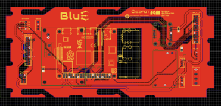
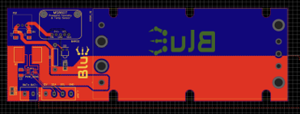

# Control and Power Management Electronics

## Overview

This repository documents the **control and power management electronics** design of the **Open Toolkit for Underwater Robotics**. The focus is on providing robust, modular, and efficient electronic control systems suitable for underwater robotics applications. The **Main board** folder and the **Battery board** folders respectively contain a csv file with the Bill Of Material (BOM), a pdf file with the electrical scheme, and two compressed folder with 3D and gerber files for visualization in electronics CAD and manufacturing the PCBs. Both PCBs have been dimensioned to fit into standard watertight enclosures add_dimensions (https://bluerobotics.com/store/watertight-enclosures/wte-vp/).

## Electronics and Power Management System

### 1. Control Board
- Based on **Raspberry Pi 4** architecture.
- Supports **RS485 communication** for **Dynamixel** actuators.
- Provides interface for the following sensor devices: BNO055 **IMU**, DHT11 **temperature and humidity sensors**, ltc2945 **power monitor**, ms5837 **pressure, temperature and humidity sensor**, ms8607 **external pressure sensor**.
- Provides interface for **PWM devices** such as torches, servomotors
- Supports 12V power input and it integrated a **DCDC converter** to supply **5V**

### 2. Power Management Board
- Regulates power supply for **motors, sensors, and communication devices**.
- Supports up to **24V power input** from battery, designed to work with a 12V 25Ah DC lithium polymer battery*.
- Includes i2c line to for internal **pressure, temperature and humidity sensor** .

## List of Components

| Component            | Specification                 | Function                                 |
|---------------------|----------------------------|-----------------------------------------|
| Single board computer    | Raspberry Pi 4             | Controls all robotic operations          |
| IMU         | BNO055       | 9 DOF IMU with fused absolute orientation     | Raw accelerations, angular velocities, magnetic field and fused absolute orientation
| Humidity and temperature sensor         | DHT11       | Early leakage detection within control and motor canisters     |
| Power monitor      | LTC2945       | Monitoring Voltage, Current and Power consumption  |
| Pressure, humidity and temperature sensor | MS5837 | Early leakage detection within battery canister          |
| External pressure and temperature sensing | MS8607 | External temperature and pressure for depth estimation          |

## Discussion & Tips
Any other interesting point or tips for improvements can go here

## Future Improvements
Same.

---
For more information, contact: **Giacomo Picardi giacomo.picardi1991@gmail.com or gpicardi@icm.csic.es** or **Matias Carandell mail**
